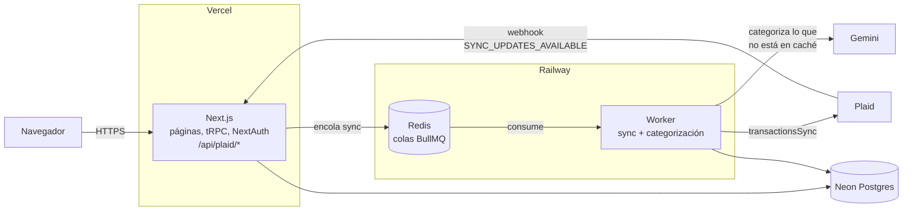

# Despliegue

Dos hosts: la app Next.js en **Vercel** y el worker BullMQ en **Railway**.
Postgres en **Neon** y Redis en **Railway** (junto al worker).



## Por qué dos hosts

Vercel ejecuta funciones serverless: tienen un tiempo máximo de ejecución y
**se congelan en cuanto mandan la respuesta**. Sincronizar con Plaid puede
tardar (paginación con cursor, cientos de transacciones) y la categorización
llama a una IA. Nada de eso cabe bien en una función.

Por eso la app solo **encola** y responde de inmediato, y un proceso
persistente en Railway **consume** la cola:

| Problema | Cómo se resuelve |
|---|---|
| Plaid espera respuesta rápida al webhook | La ruta solo encola (~100 ms) y responde 200 |
| Webhooks duplicados o en ráfaga | `deduplication` por conexión: un solo sync pendiente por banco |
| Fallos transitorios (Plaid, IA, red) | BullMQ reintenta 3 veces con backoff exponencial |
| Reintentos que duplican datos | `upsert` por `plaidTransactionId`: el sync es idempotente |
| Costo de IA | Primero se consulta `CategorizationCache`; a la IA solo va lo nuevo, en un batch |
| Redespliegue con jobs en curso | El worker atiende `SIGTERM` y espera a que terminen (`worker.close()`) |
| Si no se pudo encolar (Redis caído) | El webhook responde 500 para que Plaid reintente |

Cada sincronización deja una fila en `sync_logs` con su origen
(`initial`, `webhook`, `manual`), resultado y errores.

---

## Paso a paso

Orden: base de datos → Railway (Redis + worker) → Vercel → Google y Plaid.

### 1. Neon (Postgres)

1. Crea un proyecto en [neon.tech](https://neon.tech) en una región cercana a
   Vercel (por ejemplo `us-east-1`, que es `iad1` en Vercel).
2. En *Connection Details* copia dos cadenas:
   - **Pooled** (el host incluye `-pooler`) → `DATABASE_URL`.
     Agrégale `&pgbouncer=true&connect_timeout=15` al final.
   - **Direct** (sin `-pooler`) → `DIRECT_URL`.
3. Aplica las migraciones y crea el usuario demo desde tu máquina
   (PowerShell):

   ```powershell
   $env:DATABASE_URL="<pooled>"; $env:DIRECT_URL="<direct>"
   npm run db:deploy
   npm run db:seed
   ```

   El seed solo toca los datos de `demo@finanzas.app` y crea las categorías
   que falten, así que se puede volver a correr sin afectar a otros usuarios.

### 2. Railway (Redis + worker)

1. Crea un proyecto en [railway.com](https://railway.com) → **+ New → Database → Redis**.
2. **+ New → GitHub Repo** → este repositorio. Railway lee `railway.json` y
   construye `Dockerfile.worker` (imagen de ~380 MB: el worker va
   empaquetado con esbuild, sin Next.js).
3. En el servicio del worker → *Settings*: rama de despliegue `main`.
4. *Variables* del worker:

   | Variable | Valor |
   |---|---|
   | `DATABASE_URL` | la pooled de Neon |
   | `REDIS_URL` | `${{Redis.REDIS_URL}}` (red privada de Railway) |
   | `PLAID_CLIENT_ID`, `PLAID_SECRET` | de Plaid |
   | `PLAID_ENV` | `sandbox` |
   | `GEMINI_API_KEY` | de Google AI Studio |

   Si falta alguna, el worker sale con un error que dice cuál.
5. En el servicio de Redis → *Settings → Networking* activa la conexión
   pública (TCP Proxy). Copia `REDIS_PUBLIC_URL`: es la que usa Vercel.
6. Comprueba en los logs del worker:
   `👷 Worker escuchando: sync-transactions, categorize-transactions`.

> **Sobre el free tier:** Railway da un crédito de prueba y después cobra
> por uso (el plan Hobby). Render no ofrece *background workers* en su plan
> gratuito. `Dockerfile.worker` funciona igual en Render, solo que en un
> plan de pago.

### 3. Vercel (app Next.js)

1. **Add New → Project** → importa el repositorio. Vercel detecta Next.js;
   `postinstall` genera el cliente de Prisma.
2. *Environment Variables* (Production):

   | Variable | Valor |
   |---|---|
   | `DATABASE_URL`, `DIRECT_URL` | las de Neon |
   | `REDIS_URL` | la **pública** de Railway (`REDIS_PUBLIC_URL`) |
   | `NEXTAUTH_URL` | `https://<tu-app>.vercel.app` |
   | `NEXTAUTH_SECRET` | `openssl rand -base64 32`; **distinto** al de local |
   | `GOOGLE_CLIENT_ID`, `GOOGLE_CLIENT_SECRET` | de Google Cloud |
   | `PLAID_CLIENT_ID`, `PLAID_SECRET`, `PLAID_ENV` | de Plaid |
   | `PLAID_WEBHOOK_URL` | `https://<tu-app>.vercel.app/api/plaid/webhook` |

3. *Settings → Functions*: región igual a la de Neon.
4. Despliega.

### 4. Google OAuth

En [Google Cloud Console](https://console.cloud.google.com/apis/credentials) →
tu cliente OAuth → *Authorized redirect URIs*, agrega:

```
https://<tu-app>.vercel.app/api/auth/callback/google
```

### 5. Plaid

En sandbox no hay que registrar nada: la URL del webhook se manda en cada
link token (`PLAID_WEBHOOK_URL`). Para probar, conecta un banco con
`user_good` / `pass_good`.

---

## Verificación después de desplegar

- [ ] `https://<tu-app>.vercel.app/overview` sin sesión redirige a `/login`.
- [ ] "Explorar con datos de ejemplo" muestra el demo con datos.
- [ ] Iniciar sesión con Google lleva a `/overview` (en cero si no hay banco).
- [ ] Conectar un banco sandbox: en los logs del worker aparece
      `✅ Sync ... (initial)` y luego la categorización.
- [ ] La tabla `sync_logs` tiene filas con `status = success`.
- [ ] Las cabeceras de seguridad están presentes:
      `curl -sI https://<tu-app>.vercel.app/login`.

## Pendiente conocido

- El webhook de Plaid no verifica la firma `Plaid-Verification`.
- Los `access_token` de Plaid se guardan sin cifrar.
- No hay rate limiting.

## Desarrollo local

```bash
docker compose up -d     # Postgres :5433 y Redis :6379
cp .env.example .env     # y completa las claves
npm install
npm run db:migrate
npm run db:seed
npm run dev              # app en :3000
npm run worker           # en otra terminal
```
