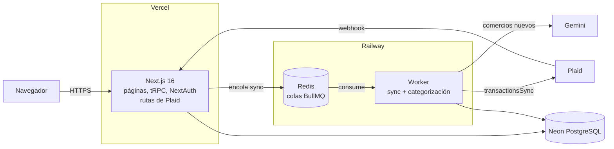

# Finanzas — Dashboard de finanzas personales con IA

Dashboard que conecta tus cuentas bancarias con Plaid, categoriza cada movimiento con IA y te muestra en qué se va tu dinero: resumen por periodo, suscripciones detectadas, gastos inusuales y una proyección de tu saldo.

**Demo en vivo:** [finanzas-ia-odn7.vercel.app](https://finanzas-ia-odn7.vercel.app) → entra con **"Explorar con datos de ejemplo"** (cuenta demo de solo lectura, sin registro).

## Funcionalidades

- **Resumen** — ingresos, gastos y balance del periodo, tendencia de 6 meses y categorías principales.
- **Transacciones** — lista paginada, filtros por cuenta y periodo, categoría editable.
- **Categorización con IA** — Gemini categoriza los comercios nuevos; los ya vistos salen de una caché sin costo.
- **Insights** — suscripciones recurrentes con su costo anual y próximo cobro, y gastos fuera de lo normal por categoría.
- **Proyecciones** — saldo estimado a 3, 6 o 12 meses según tu flujo promedio.
- **Conexión bancaria** — Plaid Link (modo sandbox); tus credenciales nunca pasan por la app.
- **Tutorial guiado** en cada página, modo privacidad para ocultar montos y diseño responsivo.

## Arquitectura



La app en Vercel solo **encola** el trabajo pesado: las funciones serverless se congelan al responder, así que sincronizar con Plaid y categorizar con IA ocurre en un worker persistente en Railway. Las colas deduplican webhooks repetidos, reintentan con backoff y la sincronización es idempotente (`upsert` por id de Plaid).

## Stack

| Capa | Tecnologías |
| --- | --- |
| Frontend | Next.js 16 (App Router), React 19, TypeScript, Tailwind CSS, Tremor, TanStack Table, Zustand, driver.js |
| API | tRPC 11, TanStack Query 5, zod, superjson |
| Datos | PostgreSQL, Prisma 5 |
| Autenticación | NextAuth 4 (Google OAuth + cuenta demo), sesiones JWT |
| Banca e IA | Plaid, Google Gemini |
| Trabajos en segundo plano | BullMQ, Redis |
| Infraestructura | Vercel, Railway (Docker), Neon |

## Desarrollo local

**Requisitos:** Node.js 20.9 o superior y Docker.

```bash
git clone https://github.com/Neltru/finanzas-ia.git
cd finanzas-ia
npm install
cp .env.example .env        # completa las claves (ver abajo)
docker compose up -d        # Postgres en :5433 y Redis en :6379
npm run db:migrate          # crea las tablas
npm run db:seed             # usuario demo con 8 meses de datos
npm run dev                 # app en http://localhost:3000
npm run worker              # en otra terminal: sync y categorización
```

### Variables de entorno

Todas están documentadas en [`.env.example`](.env.example), con el servicio donde va cada una. Las que necesitas obtener:

| Variable | Dónde se obtiene |
| --- | --- |
| `NEXTAUTH_SECRET` | `openssl rand -base64 32` |
| `GOOGLE_CLIENT_ID`, `GOOGLE_CLIENT_SECRET` | [Google Cloud Console](https://console.cloud.google.com/apis/credentials) → cliente OAuth; redirect URI `http://localhost:3000/api/auth/callback/google` |
| `PLAID_CLIENT_ID`, `PLAID_SECRET` | [Plaid Dashboard](https://dashboard.plaid.com) → Keys (sandbox) |
| `GEMINI_API_KEY` | [Google AI Studio](https://aistudio.google.com/apikey) |

En local, `DATABASE_URL`, `DIRECT_URL`, `REDIS_URL` y `NEXTAUTH_URL` deben apuntar a `localhost`. Para conectar un banco en sandbox usa el usuario `user_good` y la contraseña `pass_good`.

### Scripts

| Script | Qué hace |
| --- | --- |
| `npm run dev` | Servidor de desarrollo |
| `npm run build` | Build de producción |
| `npm run typecheck` | Verificación de tipos |
| `npm run worker` | Worker de sincronización y categorización |
| `npm run db:migrate` | Crea y aplica migraciones en desarrollo |
| `npm run db:deploy` | Aplica migraciones en producción |
| `npm run db:seed` | Crea o regenera el usuario demo (solo toca sus datos) |
| `npm run db:studio` | Explorador visual de la base de datos |

## Estructura

```
src/
├── app/
│   ├── (dashboard)/        # páginas protegidas: overview, transactions, accounts, insights, projections, connect
│   ├── api/                # NextAuth, tRPC y rutas de Plaid (link-token, exchange-token, webhook)
│   └── login/
├── components/             # layout, gráficas, tabla de transacciones, tutorial
├── lib/                    # filtros en la URL, formato, cliente tRPC
├── server/
│   ├── trpc/               # routers y procedimientos (protected / write)
│   ├── services/           # Plaid, categorización, insights, proyecciones
│   └── jobs/               # colas BullMQ y worker
└── proxy.ts                # protección de rutas
prisma/                     # esquema, migraciones y seed
```

## Seguridad

- Cada consulta filtra por el usuario de la sesión: nadie puede leer ni modificar datos ajenos.
- La cuenta demo es de solo lectura (403 en cualquier escritura).
- Cabeceras de seguridad (`X-Frame-Options`, HSTS, `nosniff`, `Referrer-Policy`) y validación de entrada con zod.

## Despliegue

Guía paso a paso (Neon, Railway, Vercel, Google y Plaid) en [DEPLOY.md](DEPLOY.md).

## Limitaciones conocidas

- Plaid funciona en modo sandbox: solo bancos y datos de prueba.
- El webhook de Plaid aún no verifica la firma `Plaid-Verification`.
- No hay pruebas automatizadas; la verificación es `npm run typecheck` y pruebas manuales.
- En el plan gratuito de Neon, la primera petición tras un rato sin uso puede tardar unos segundos.
